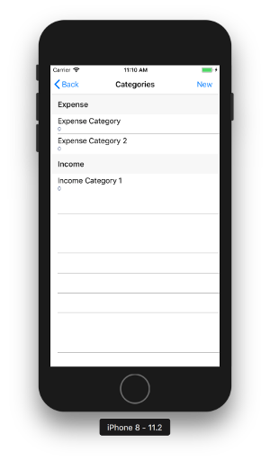

# EasyBudget.Forms
Xamarin.Forms app for EasyBudget app using Sqlite-net-pcl, a simple DI container and OxyPlot

## Project Web Pages
**Project Web Page** [Project Web Page](http://www.crawfordnetsolutions.com/projects/easybudget-1-0-beta/)
**Design Notes** [Design Notes With UML and Wireframes](http://www.crawfordnetsolutions.com/projects/easybudget-1-0-beta/easybudget-design-notes-v1-0/)

## Notes
1) This application is very much a Work In Progress and utilizes Sqlite-net-pcl and OxyPlot nuget packages.
2) A DataServiceHelper class, registered in the Android and iOS projects with a simple IoC container, provides the EasyBudgetDataService class with the local path to the location where the Sqlite database is located. 
3) A class in each platform-specific project named FileAccessHelper provides the platform-specific path of files read and written to the device.
4) The EasyBudgetDataService class provides methods to get instances of the View Model classes, and each View Model class provides methods to Save changes or Delete referenced data objects.
5) Screens are coming along nicely. 
6) View Models are 99% completed an tested. 
7) Both Android and iOS versions of app are nearing completion.

## Screenshots
Here are a few screenshots. (more to come soon)

Budget Categories | Context Actions
--------|--------
 | 
Editor | Picker Control
 | 
Delete Confirmation | Deleted Message
 | 

